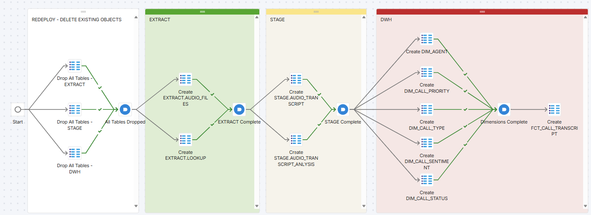

# 00_DDL: Create Tables

## Overview
The orchestration pipeline in [BUILD_SCHEMA_DW.orch.yaml](BUILD_SCHEMA_DW.orch.yaml) recreates the core Snowflake schema from a clean starting point, making it easy to reset and redeploy your environment.

<p align="center">
  
</p>

### Redeploy - Delete Existing Objects
The white segment, executes drop commands to clear all exisiting Tables in the three schemas.

```sql
--Drop all Tables - Schema: Extract
DROP TABLE IF EXISTS EXTRACT.AUDIO_FILES;
DROP TABLE IF EXISTS EXTRACT.LOOKUP;

--Drop all Tables - Schema: Stage
DROP TABLE IF EXISTS STAGE.AUDIO_TRANSCRIPT;
DROP TABLE IF EXISTS STAGE.AUDIO_TRANSCRIPT_ANALYSIS;

--Drop all Tables - Schema: DWH
DROP TABLE IF EXISTS DIM_AGENT;
DROP TABLE IF EXISTS DIM_CALL_PRIORITY;
DROP TABLE IF EXISTS DIM_CALL_TYPE;
DROP TABLE IF EXISTS DIM_CALL_SENTIMENT;
DROP TABLE IF EXISTS DIM_CALL_STATUS;
```

### Create tables for Extract 
Create `EXTRACT.AUDIO_FILES` runs:
[../04_RESOURCES/SQL/DDL/EXTRACT/AUDIO_FILES.sql](../04_RESOURCES/SQL/DDL/EXTRACT/AUDIO_FILES.sql)

Create `EXTRACT.LOOKUP` runs:
[../04_RESOURCES/SQL/DDL/EXTRACT/LOOKUP.sql](../04_RESOURCES/SQL/DDL/EXTRACT/LOOKUP.sql)


### Create tables for Stage 
Create `STAGE.AUDIO_TRANSCRIPT` runs:
[../04_RESOURCES/SQL/DDL/STAGE/AUDIO_TRANSCRIPT_ANALYSIS.sql](../04_RESOURCES/SQL/DDL/STAGE/AUDIO_TRANSCRIPT.sql.sql)

Create `STAGE.AUDIO_TRANSCRIPT_ANALYSIS`runs: 
[../04_RESOURCES/SQL/DDL/STAGE/AUDIO_TRANSCRIPT_ANALYSIS.sql](../04_RESOURCES/SQL/DDL/STAGE/AUDIO_TRANSCRIPT_ANALYSIS.sql)

### Stage - Create tables for DWH
Create `DWH.DIM_AGENT`runs: 
[../04_RESOURCES/SQL/DDL/DWH/DIM_AGENT.sql](../04_RESOURCES/SQL/DDL/DWH/DIM_AGENT.sql)

Create `DWH.DIM_CALL_PRIORITY`runs: 
[../04_RESOURCES/SQL/DDL/DWH/DIM_CALL_PRIORITY.sql](../04_RESOURCES/SQL/DDL/DWH/DIM_CALL_PRIORITY.sql)

Create `DWH.DIM_CALL_TYPE`runs: 
[../04_RESOURCES/SQL/DDL/DWH/DIM_CALL_TYPE.sql](../04_RESOURCES/SQL/DDL/DWH/DIM_CALL_TYPE.sql) 

Create `DWH.DIM_CALL_SENTIMENT`runs: 
[../04_RESOURCES/SQL/DDL/DWH/DIM_CALL_SENTIMENT.sql](../04_RESOURCES/SQL/DDL/DWH/DIM_CALL_SENTIMENT.sql)

Create `DWH.DIM_CALL_STATUS`runs: 
[../04_RESOURCES/SQL/DDL/DWH/DIM_CALL_SENTIMENT.sql](../04_RESOURCES/SQL/DDL/DWH/DIM_CALL_STATUS.sql)

Once all the dimension tables are created, we create the fact table: 

Create `DWH.FCT_CALL_TRANSCRIPT`runs: 
[../04_RESOURCES/SQL/DDL/DWH/DIM_CALL_SENTIMENT.sql](../04_RESOURCES/SQL/DDL/DWH/FCT_CALL_TRANSCRIPT.sql)

