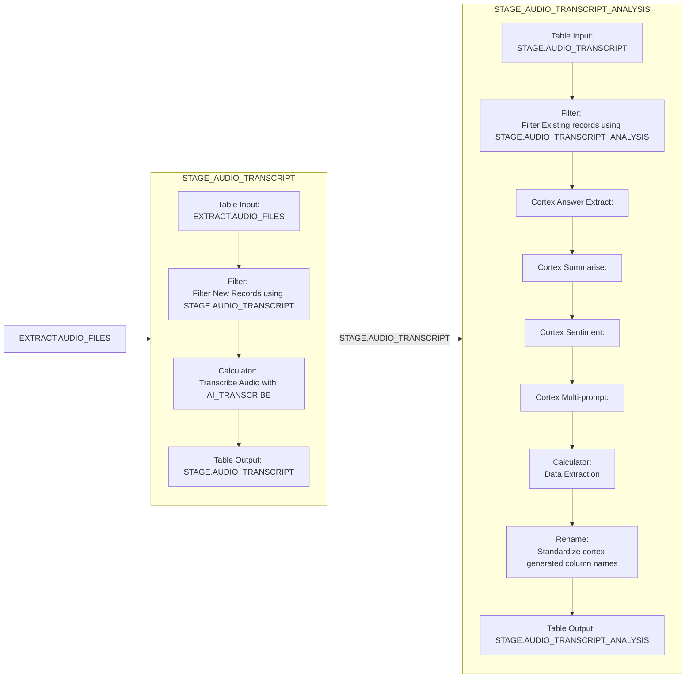

# STAGE - Data Transformation and Staging
## Purpose
This folder contains transformation pipelines (.tran.yaml) that clean, transform, and prepare data within the data warehouse.

## Implementation 
We have two transformation pipelines [STAGE_AUDIO_TRANSCRIPT](STAGE_AUDIO_TRANSCRIPT.tran.yaml) & [STAGE_AUDIO_TRANSCRIPT_ANALYSIS](STAGE_AUDIO_TRANSCRIPT_ANALYSIS.tran.yaml). 

## Contents
- Data cleansing and validation pipelines
- Business rule transformations
- Data enrichment and calculated fields
- Data type conversions and formatting
- Staging table population

## Pipeline Types
- **Transformation pipelines only** (.tran.yaml)
- Data transformations within the warehouse
- Data quality and validation processes

## Schemas Typically Used
- Source: `EXTRACT` schema (raw data)
- Target: `STAGE` schema (cleaned/transformed data)

## Naming Convention
- Reflect the transformation purpose
- Include entity names being transformed
- Examples: `clean_customer_data.tran.yaml`, `calculate_metrics.tran.yaml`

## Best Practices
- Use idempotent transformations
- Implement data quality checks
- Document business logic and transformations
- Test with sample data before full runs