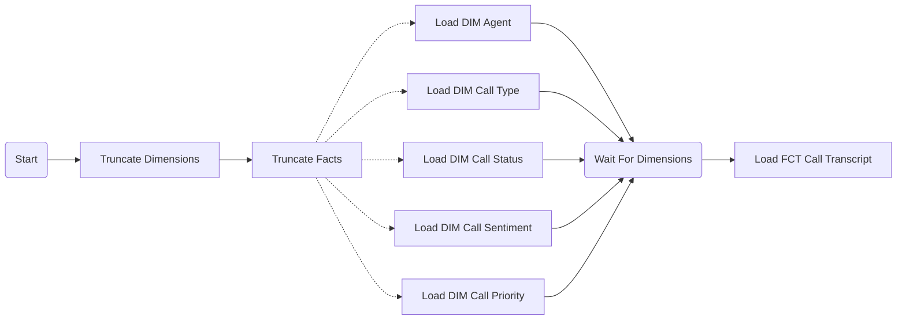
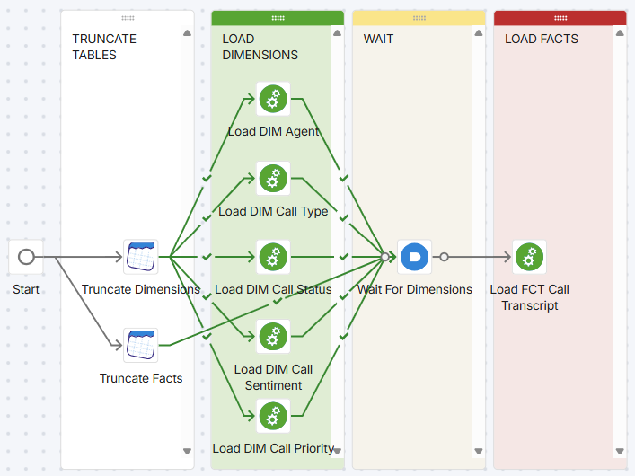
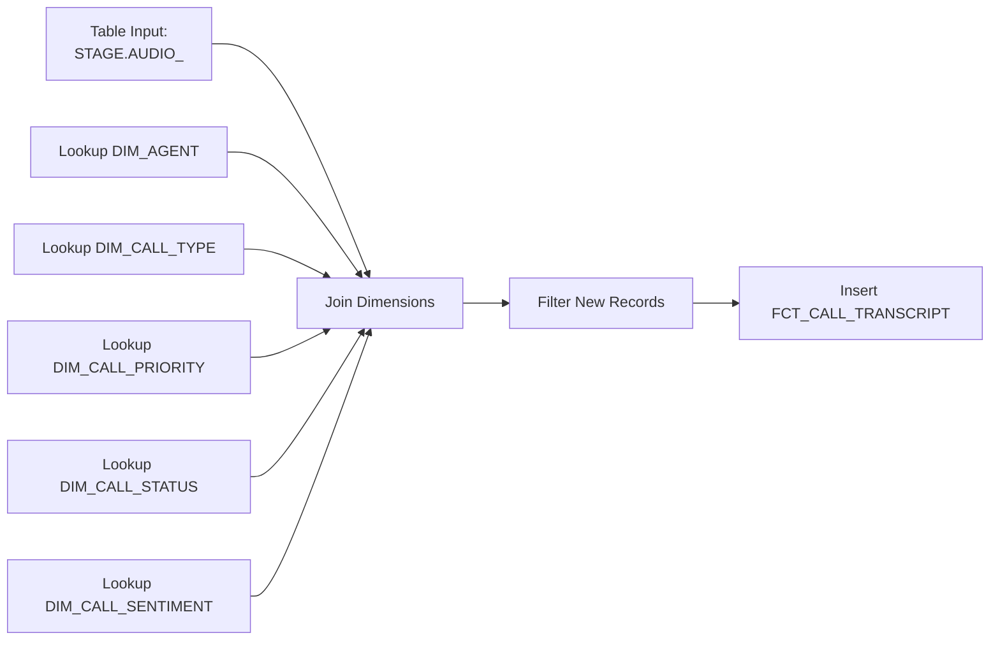
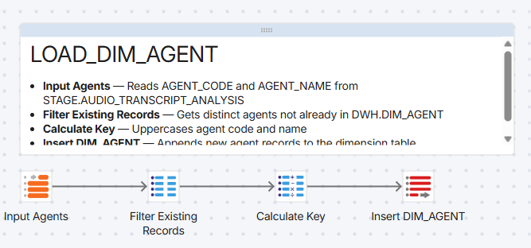
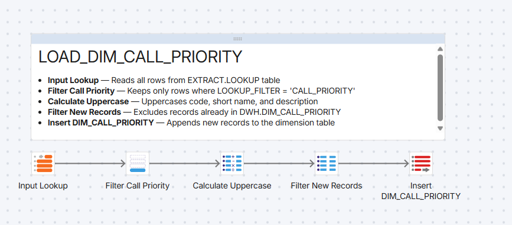
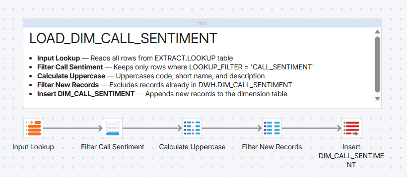
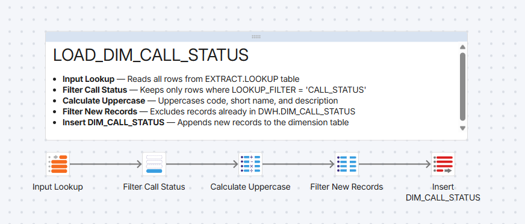
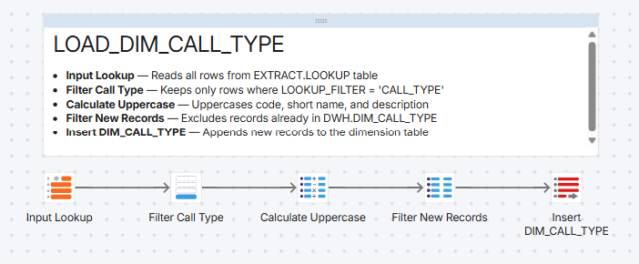
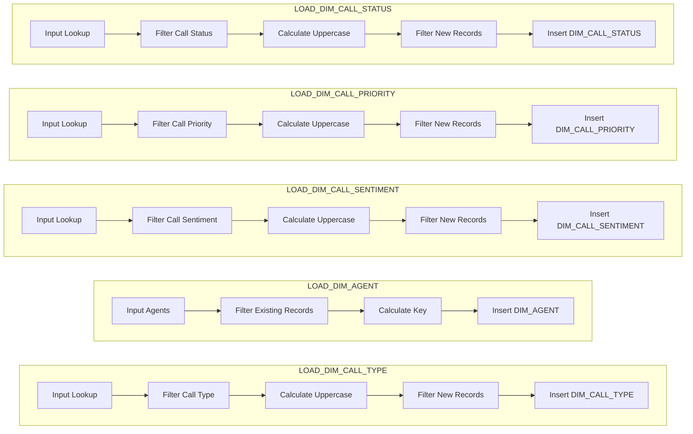

# LOAD - Final Data Loading and Analytics

## Purpose
This folder contains pipelines that load transformed data into final analytics tables, data marts, and reporting structures.

## Implementation
In this phase we create a bunch of transformation pipelines, which we call `Children Packages`, which are orchestrated by a `Parent Package` which is an orchestration pipeline.

Our Parent package is illustrated here: [PARENT_LOAD_WH](PARENT_LOAD_DWH.orch.yaml).

The [LOAD_FCT_CALL_TRANSCRIPT](LOAD_FCT_CALL_TRANSCRIPT.tran.yaml) transfrmation pipeline ingests all of the dimension tables (`DWH.DIM_XXXX`) and the data from the  to create a Fact table.

lastly are the various `LOAD_DIM_XXXX` transfromation pipeline
    

## Contents
- Fact table population pipelines
- Dimension table updates
- Data mart creation
- Aggregate table building
- Final business-ready dataset preparation

## Pipeline Types
- Can include both orchestration (.orch.yaml) and transformation (.tran.yaml)
- Final stage transformations and loading
- Analytics table population

## Schemas Typically Used
- Source: `STAGE` schema (transformed data)
- Target: `ANALYTICS`, `MART`, or business-specific schemas

## Naming Convention
- Reflect final output or business purpose
- Include target schema/mart names
- Examples: `load_sales_mart.tran.yaml`, `build_customer_360.orch.yaml`

## Best Practices
- Ensure data consistency with ACID properties
- Implement slowly changing dimension logic where needed
- Optimize for query performance
- Create indexes and constraints on final tables